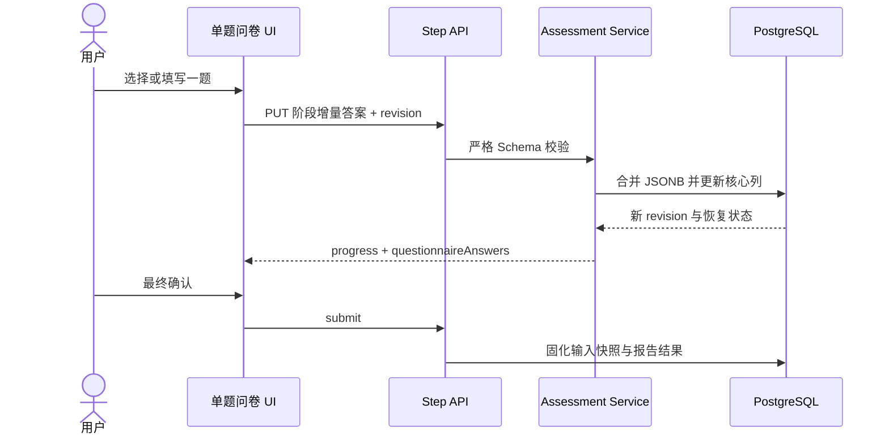

# 健康测评竞品对标整改方案 v2.0

## 1. 文档状态

- 状态：本地实施与验收完成
- 日期：2026-09-28
- 任务等级：L3，高风险全栈整改
- 来源依据：挑战 PDF、用户验收反馈、BetterMe Pilates `flow=2117` 浏览器实测、当前源码与数据库迁移
- 替代关系：本方案替代 v1.1 的“四步轻量问卷”产品基线；原有会话、数据归属、幂等、删除和模拟支付安全边界继续保留。

## 2. 用户验收结论

上一版工程测试通过，但产品验收失败，不能继续标记为“交付完成”。已确认的核心缺陷：

1. 目标体重被 `当前体重 × 80%`、BMI 和两年窗口共同限制，导致部分用户无法填写真实目标。
2. 前端只有 4 个页面和少量字段，未形成竞品式渐进问卷体验。
3. 几乎没有真实图片，选项缺乏视觉辨识度，首页仍是 CSS 占位插画。
4. 报告只使用少量身体数据，前面收集的生活方式、活动能力和饮食习惯不存在。

## 3. 竞品实测基线

浏览器从年龄入口实际走查到事件日期页，共观察到约 27 个有效问题、多个激励/结果过渡页和 4 个主要主题阶段：

| 阶段 | 实测问题示例 | 视觉特征 |
| --- | --- | --- |
| My Profile | Pilates 经历、主目标、附加目标、体型、理想状态、体重变化、最佳状态时间 | 年龄 4 图卡、体型 4 图卡、全屏人物背景、阶段激励图 |
| Activity | 柔韧性、运动频率、目标部位、爬楼呼吸、腰背/膝盖敏感、步行、器械经历与顾虑 | 目标部位 6 图卡、身体状况 3 图卡、运动背景图 |
| Lifestyle & Habits | 工作节奏、典型一天、能量、饮水、睡眠 | 饮水、睡眠等主题图片与单题单屏 |
| Nutrition | 三餐时间、饮食偏好、饮食习惯 | 餐次图片、长选项列表、分组说明 |
| Almost There | 身高、当前体重、目标体重、年龄、事件 | 独立数字输入、健康数据授权、分析进度、BMI/画像摘要 |

竞品实测体重提示范围为 `55–662 lb`，约 `25–300 kg`。它没有采用“目标必须不低于当前体重 80%”的限制。整改只参考信息架构、节奏和密度，不复制其文字、品牌、图片或付费承诺。

## 4. 整改后的功能边界

### 4.1 问卷

- 采用 5 个主题阶段、约 34 个问题/确认项、单题单屏。
- 单选自动进入下一题；多选和数字输入显式点击继续。
- 每题保存到服务端，刷新后从该阶段最后已回答位置恢复。
- 阶段间加入原创图片激励页，但不伪造专家、媒体或用户数量背书。

### 4.2 数据范围

- 年龄：18–80 岁。
- 身高：90–242 cm。
- 当前/目标体重：25–300 kg。
- 目标体重只校验物理输入范围，不再用 BMI、20% 变化或两年预测窗口拒绝保存。
- 目标方向与主目标不一致时，以提示代替阻断；极端 BMI 或大幅变化以风险提示代替伪精确承诺。

### 4.3 报告

- 保留 BMI、基础能量和目标情景，但明确其非医疗用途。
- 新增活动画像、生活节律、恢复状态、饮食偏好、目标部位和行动建议。
- 长期目标仍给出分阶段路线，不因为超过两年而清空曲线或拒绝报告。

### 4.4 原创视觉

- 6 张原创资产：首页 Pilates、年龄人像、活动能力、生活营养、结果页、目标部位。
- 使用本地静态资源和 `next/image`，不依赖竞品 CDN。
- 保持暖米色、深棕、珊瑚与鼠尾草配色，但不复刻竞品版式细节。

## 5. 数据模型设计

在 `assessments` 增加：

```text
questionnaire_answers JSONB NOT NULL DEFAULT '{}'
```

结构按阶段保存：

```json
{
  "profile": {},
  "activity": {},
  "lifestyle": {},
  "nutrition": {},
  "metrics": {}
}
```

核心可计算字段继续保留独立列，避免报告查询依赖 JSON：`age`、`sex`、`goal`、`height_cm`、`weight_kg`、`target_weight_kg`、`activity_level`。JSONB 用于扩展问卷和回答恢复；结果表的 `input_snapshot` 保存提交时完整快照，保证报告可追溯。

## 6. 前后端实施计划

| 阶段 | 文件/模块 | 验收条件 | 状态 |
| --- | --- | --- | --- |
| A | Prisma schema、增量迁移、契约类型 | 旧数据兼容，空对象默认值生效 | 完成 |
| B | Schema、领域校验、保存服务、报告映射 | 25 kg 目标可保存；每阶段可部分保存与恢复 | 完成 |
| C | 问卷配置与单题单屏引擎 | 5 阶段、34 个问题/确认项、进度和逐题恢复可用 | 完成 |
| D | 首页、过渡页、报告页、6 张原创图片 | 移动端和桌面端无占位插画 | 完成 |
| E | 单元、PostgreSQL 集成、E2E、视觉走查 | 核心质量门全部通过，用户缺陷有回归用例 | 完成 |

## 7. 调用链



## 8. 风险与回滚

- 健康风险：不做诊断；异常范围用提示和专业咨询建议处理，不生成“保证减重”文案。
- 数据风险：JSONB 只存严格白名单字段；会话归属、乐观锁、删除闭环保持不变。
- 兼容风险：增量列带默认值；旧草稿会从第一未完成阶段继续。
- 性能风险：图片通过 `next/image` 响应式加载；首屏只预加载一张。
- 回滚：代码可回退到上一版本；新增 JSONB 列不会改变既有核心字段。数据库列删除不作为自动回滚动作，避免数据丢失。

## 9. 验收矩阵

| 场景 | 预期 |
| --- | --- |
| 当前 100 kg、目标 60 kg | 接受输入，不再强制目标 ≥ 80 kg |
| 当前 70 kg、目标 25 kg | 接受物理范围下限，报告给出长期分阶段提示 |
| 刷新任意主题阶段 | 已保存答案恢复，定位到下一未答题 |
| 多选“无以上情况” | 与其他选项互斥 |
| 完成 5 个主题阶段 | 可提交并生成包含生活/活动画像的报告 |
| 手机 390×844 | 单题单屏可操作，主要按钮无需横向滚动 |
| 桌面 1440×1000 | 内容宽度、图片与选项保持竞品式高信息密度 |

## 10. 实施与验收结果

- 数据库：`questionnaire_answers` 增量列、90–242 cm / 25–300 kg 范围、18–80 岁完成态、低/高能量结果与长期预测约束均通过开发库和隔离测试库迁移。
- 服务端：五阶段增量合并、顺序门禁、revision、幂等、提交快照、报告画像和风险提示完成；目标 25 kg 与超过两年的长期情景均有 PostgreSQL 回归用例。
- 前端：34 项单题单屏、刷新后定位首个未答题、移动/桌面响应式布局、原创图片和报告画像完成；修复了恢复到多选/数字/同意题后首次编辑跳回第 1 题的问题。
- 自动化：`npm run verify` 通过；15 项单元测试、29 项真实 PostgreSQL 集成测试、Playwright 12 项通过且 2 项按配置仅由桌面端覆盖、Next.js 生产构建通过。
- 视觉：390×844 与 1440×1000 均无横向溢出，图片加载完整；当前测试容器未安装 CJK 字体，截图中文字形验证属于环境残余项，DOM 文本、可访问名称和业务断言均已通过。
- 公网部署：未执行，当前没有被授权的 Git 远端、云数据库或部署平台资源。
